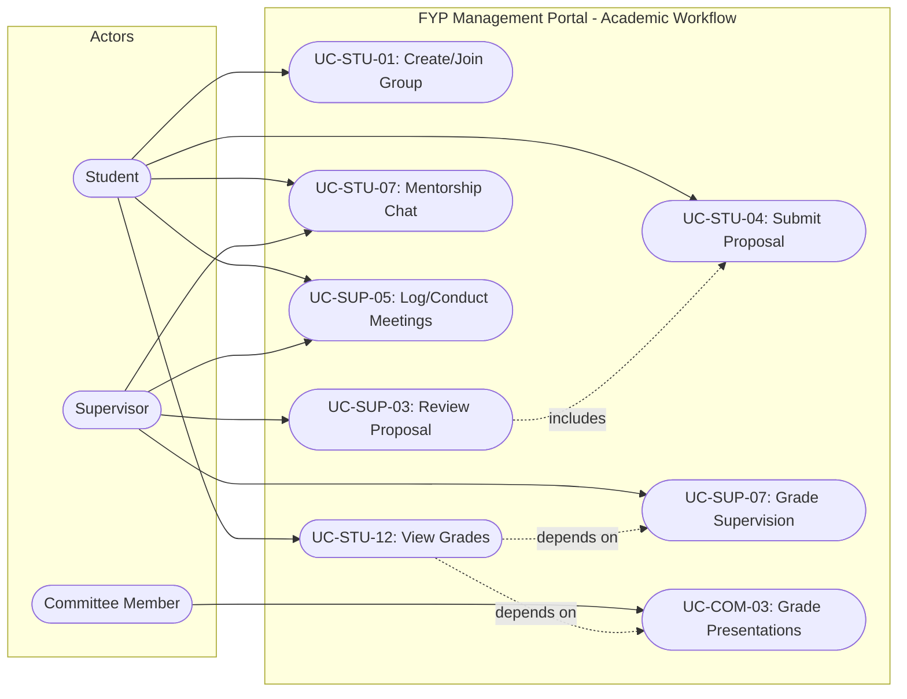
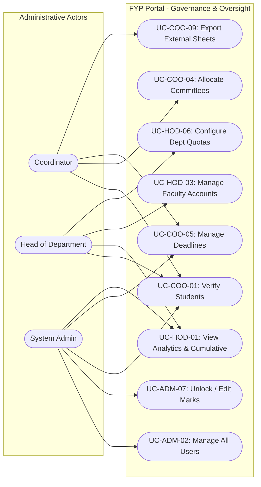

# FYP Management Portal - System Roles & Use Case Specifications

This document defines all primary and secondary actors (roles), their permissions, use cases, and interactions across the FYP (Final Year Project) Management Portal. It is specifically structured for easy translation into **UML Use Case Diagrams**, actor catalogs, and functional specification matrices.

---

## 1. Actor Catalog (Roles Overview)

The system defines **6 primary authenticated roles** and **1 unauthenticated/public actor**:

```
                              ┌─────────────────────────┐
                              │     Guest / Visitor     │
                              │     (Public User)       │
                              └────────────┬────────────┘
                                           │
                                           ▼
┌────────────────────────────────────────────────────────────────────────────────────────┐
│                                Authenticated Users                                     │
├────────────────────┬────────────────────┬─────────────────────┬────────────────────────┤
│     Student        │     Supervisor     │  Committee Member   │ Department Coordinator │
│ (Project Creator)  │  (Faculty Mentor)  │ (Presentation Jury) │ (Operational Admin)    │
├────────────────────┴────────────────────┴─────────────────────┴────────────────────────┤
│           Head of Department (HOD)      │           System Administrator               │
│             (Department Executive)      │           (Superuser / Root Admin)           │
└─────────────────────────────────────────┴──────────────────────────────────────────────┘
```

---

## 2. Common / Cross-Cutting Use Cases (All Authenticated Actors)

Every logged-in user can access the following standard system actions:

| Use Case ID | Use Case Name | Pre-conditions | Description / Steps |
| :--- | :--- | :--- | :--- |
| **UC-GEN-01** | User Login | Valid account status (`approved`) | Authenticate via email and password; session regenerated securely. |
| **UC-GEN-02** | User Logout | User is logged in | Invalidate active session and redirect to login page. |
| **UC-GEN-03** | Reset Password | Registered email | Request password reset token via email link to set a new password. |
| **UC-GEN-04** | Change Password | User is logged in | Update current password with validation of old credentials. |
| **UC-GEN-05** | View / Update Profile | User is logged in | View profile information, update contact details, surname/title prefix, and avatar. |
| **UC-GEN-06** | Switch Active Role | Multi-role user (e.g. Supervisor + Committee) | Switch context between assigned roles without re-logging in. |
| **UC-GEN-07** | Toggle Theme | User is logged in / browsing | Switch UI appearance between Dark Mode and Light Mode. |
| **UC-GEN-08** | Inactivity Auto-Logout | 15 minutes of inactivity | Protect session by terminating inactive users automatically. |

---

## 3. Public / Guest Actor

### Actor Summary
Unauthenticated university visitors, incoming students, or external entities visiting the portal.

### Detailed Actions & Use Cases
* **UC-PUB-01: Browse Landing Page**  
  * Access the home portal, banner information, mission statement, and guidelines.
* **UC-PUB-02: Search & Filter Previous Projects**  
  * Search project archives by keyword, academic year, department, shift, or technology stack.
* **UC-PUB-03: View Project Details**  
  * View abstract, team members, supervisor name, and repository links for completed projects.
* **UC-PUB-04: Submit Contact Query**  
  * Fill out the contact inquiry form (triggers PHPMailer notification to admins/coordinators).
* **UC-PUB-05: Register Student Account**  
  * Submit student registration (Roll number / Student ID, CNIC, email, department, shift, batch, password).  
  * *Outcome:* Account created with `pending` status awaiting coordinator or HOD verification.

---

## 4. Student Actor

### Actor Summary
Undergraduate students working towards completing their final year capstone project.

### Detailed Actions & Use Cases

#### A. Group & Member Formation
* **UC-STU-01: Create FYP Group**  
  * Create a new project group within their assigned department and batch (creator becomes Group Leader).
* **UC-STU-02: Invite / Add Group Members**  
  * Search for registered peers in the same batch/shift and add them up to the department limit.
* **UC-STU-03: Remove Group Member / Leave Group**  
  * Manage group membership before proposal approval.

#### B. Project Proposals
* **UC-STU-04: Submit Project Proposal**  
  * Group leader submits project title, description, problem statement, tools/technologies, proposed supervisor, and proposal PDF document.
* **UC-STU-05: Track Proposal Status**  
  * Monitor real-time status progression (`Pending` ➔ `Under Review` ➔ `Approved` / `Rejected` / `Revision Needed`).
* **UC-STU-06: Revise Proposal**  
  * Modify proposal content or re-upload documentation according to supervisor feedback.

#### C. Mentorship, Meetings & Collaboration
* **UC-STU-07: Chat with Supervisor**  
  * Real-time text messaging with assigned supervisor.
* **UC-STU-08: Send Chat Attachments**  
  * Upload document files, diagrams, screenshots, or code archives into the supervisor chat thread.
* **UC-STU-09: View Meeting Schedule**  
  * View upcoming supervisor advisory sessions and track logbook attendance/status.
* **UC-STU-10: Interact with AI Chatbot**  
  * Ask the floating AI chatbot for university formatting guidelines, templates, rules, and milestone deadlines.

#### D. Evaluations & Grades
* **UC-STU-11: View Presentation Schedules**  
  * Check venue, date, time slot, and assigned committee for defense presentations.
* **UC-STU-12: View Grades and Rubrics**  
  * View published marks (Supervision marks, Proposal Defense, Progress Presentation, Final Defense) once marked visible by faculty.

---

## 5. Supervisor Actor

### Actor Summary
Faculty members assigned to guide, mentor, audit, and evaluate project groups.

### Detailed Actions & Use Cases

#### A. Proposal Vetting & Group Supervisions
* **UC-SUP-01: View Supervised Groups**  
  * Access listing of groups assigned to the supervisor across batches and shifts.
* **UC-SUP-02: Review Project Proposals**  
  * Preview submitted proposal documents (native inline PDF viewer).
* **UC-SUP-03: Accept / Reject / Request Revision on Proposal**  
  * Approve or decline student proposals with granular written comments and feedback.

#### B. Progress Tracking & Mentorship
* **UC-SUP-04: Group Chat & Mentorship**  
  * Engage in dedicated group messaging threads with supervisee groups.
* **UC-SUP-05: Manage Supervision Meetings**  
  * Schedule, reschedule, or cancel formal student meetings; record logbook meeting discussions and progress notes.
* **UC-SUP-06: Mark Meeting Completion**  
  * Confirm student attendance and record meeting outcomes.

#### C. Grading & Evaluation
* **UC-SUP-07: Enter Supervision Marks**  
  * Grade individual student performance across weekly progress, deliverables, and conduct.
* **UC-SUP-08: Toggle Grade Visibility**  
  * Hold or publish internal supervisor marks to students.
* **UC-SUP-09: Explore Previous Projects Archive**  
  * Reference past projects for domain comparison and plagiarism prevention.

---

## 6. Committee Member Actor

### Actor Summary
Faculty panel members appointed to examine and score student defenses.

### Detailed Actions & Use Cases

#### A. Presentations & Defenses
* **UC-COM-01: View Assigned Defense Schedule**  
  * View list of project groups scheduled under their specific committee number.
* **UC-COM-02: Access Project Documentation**  
  * Review student proposal abstracts, supervisor remarks, and submitted presentation files.

#### B. Rubric Evaluation & Digital Grading
* **UC-COM-03: Grade Proposal Defense**  
  * Enter individual rubric marks for problem statement, methodology, feasibility, and Q&A.
* **UC-COM-04: Grade FYP Progress Presentation**  
  * Enter individual scores for mid-term implementation, system architecture, and demo.
* **UC-COM-05: Grade Final Presentation & Defense**  
  * Score final deliverables, thesis report quality, software/hardware demonstration, and viva.
* **UC-COM-06: Submit Feedback & Recommendations**  
  * Record committee comments (Pass, Major Revision, Minor Revision, Fail).
* **UC-COM-07: Publish / Finalize Committee Scores**  
  * Lock scores and toggle visibility for students and coordinators.

---

## 7. Department Coordinator Actor

### Actor Summary
Administrative faculty managing daily departmental FYP lifecycle operations, verification, and logistics.

### Detailed Actions & Use Cases

#### A. User & Student Verification
* **UC-COO-01: Verify Student Registrations**  
  * Review newly registered student profiles against university enrollment records; **Approve** or **Reject** accounts (triggers automatic notification email).
* **UC-COO-02: Manage Batch-wise Student Rosters**  
  * Filter and inspect student directory by academic batch, department, and shift (Morning/Evening).

#### B. Proposal & Group Allocations
* **UC-COO-03: Review Department Proposals**  
  * Oversee proposal statuses department-wide; mediate unassigned groups.
* **UC-COO-04: Allocate Groups to Committees**  
  * Assign project groups to specific evaluation committees (e.g. Committee 1, Committee 2).

#### C. Deadlines & Department Communications
* **UC-COO-05: Manage Department Deadlines**  
  * Set, activate, or extend deadlines for Proposal Submission, Proposal Defense, Progress Defense, and Final Defense.
* **UC-COO-06: Generate & Publish Notice Board Announcements**  
  * Create rich announcements with attached circulars and PDF notices.

#### D. Sheets, Audits & External Assessments
* **UC-COO-07: Generate Attendance Sheets**  
  * Export/print official sign-in sheets for defense days.
* **UC-COO-08: Generate Presentation Evaluation Sheets**  
  * Export printable and digital grading matrices for jury panels.
* **UC-COO-09: Generate External Assessment Sheet**  
  * Export comprehensive CSV/Excel assessment sheets formatted for external examiners.
* **UC-COO-10: Audit Meeting Logs**  
  * Monitor supervisor-student logbook meeting frequencies to detect dormant groups.
* **UC-COO-11: Manage Academic Batches**  
  * Create academic batches and toggle registration windows.

---

## 8. Head of Department (HOD) Actor

### Actor Summary
Departmental executive who oversees academic quality, faculty allocations, and policy enforcement.

### Detailed Actions & Use Cases

#### A. Executive Dashboard & Analytics
* **UC-HOD-01: View Departmental Analytics**  
  * Review statistical metrics: total projects, domain distribution (AI, Web, IoT, etc.), supervisor allocation loads, and pass/fail ratios.
* **UC-HOD-02: View Cumulative Grade Sheets**  
  * Inspect complete department marksheets across all presentation stages and supervisor assessments.

#### B. Faculty & Staff Management
* **UC-HOD-03: Manage Supervisor Accounts**  
  * View, create, update, or deactivate supervisor faculty profiles.
* **UC-HOD-04: Manage Committee Members**  
  * Constitute defense committees, assign committee heads, and allocate faculty members.
* **UC-HOD-05: Manage Department Coordinators**  
  * Appoint and manage departmental coordinators.

#### C. Policy & Department Configuration
* **UC-HOD-06: Configure Department Settings**  
  * Set maximum supervisee slots per supervisor (Morning/Evening), maximum members per group, and number of active committees.
* **UC-HOD-07: Executive Student Verification**  
  * Final sign-off or intervention on pending/disputed student registrations.
* **UC-HOD-08: Archive & Manage Department Past Projects**  
  * Curate repositories and past thesis archives.

---

## 9. System Administrator Actor

### Actor Summary
Superuser possessing unconstrained administrative control over the portal, database, system health, and configurations.

### Detailed Actions & Use Cases
* **UC-ADM-01: View System-Wide Dashboard**  
  * View global platform statistics across all departments, batches, and user roles.
* **UC-ADM-02: Complete User Management (CRUD)**  
  * Create, edit, activate, deactivate, or delete any user account across any role.
* **UC-ADM-03: Force Group & Project Modifications**  
  * Reassign supervisors, dissolve invalid groups, update project titles, or edit approved groups.
* **UC-ADM-04: Supervisor Slot Overrides**  
  * Manually configure and override supervisor quota capacities.
* **UC-ADM-05: Manage Evaluation Committees**  
  * Reorganize committee configurations and group allocations across the system.
* **UC-ADM-06: Global Meeting & Attendance Audit**  
  * Audit all scheduled and completed meetings across all supervisors.
* **UC-ADM-07: Grade Alteration & Audit Log**  
  * Correct clerical score errors or unlock submitted grading sheets upon departmental request.
* **UC-ADM-08: Master Sheets Generation**  
  * Generate and print cumulative sheets, attendance sheets, and presentation sheets.

---

## 10. Master Use Case Traceability Matrix

| Use Case Category | Specific Use Case | Public | Student | Supervisor | Committee | Coordinator | HOD | Admin |
| :--- | :--- | :---: | :---: | :---: | :---: | :---: | :---: | :---: |
| **Authentication** | Register Account | ● | | | | | | |
| | Login / Logout | | ● | ● | ● | ● | ● | ● |
| | Password Reset / Change | | ● | ● | ● | ● | ● | ● |
| | Switch Role | | | ● | ● | ● | ● | |
| **Student Verification**| Verify/Approve Student | | | | | ● | ● | ● |
| **Group Operations** | Form / Manage Group | | ● | | | | | ● |
| | Set Max Group Limit | | | | | | ● | ● |
| **Proposals** | Submit Proposal | | ● | | | | | |
| | Accept / Reject Proposal | | | ● | | ● | | ● |
| | Track Status | | ● | ● | | ● | ● | ● |
| **Mentorship** | Chat & Share Files | | ● | ● | | | | |
| | Schedule & Log Meetings | | ● | ● | | | | |
| | Audit Meetings | | | | | ● | ● | ● |
| **Evaluations** | Grade Supervision | | | ● | | | | ● |
| | Grade Presentations | | | | ● | | | ● |
| | View Final Marks | | ● | ● | ● | ● | ● | ● |
| | Toggle Grade Visibility | | | ● | ● | | | ● |
| **Management** | Post Notices | | | | | ● | | ● |
| | Set Stage Deadlines | | | | | ● | | ● |
| | Assign Committees | | | | | ● | ● | ● |
| | Manage Batches | | | | | ● | | ● |
| | Manage Faculty Accounts | | | | | | ● | ● |
| | Configure Department Slots | | | | | | ● | ● |
| **Reports** | Attendance Sheets | | | | | ● | | ● |
| | Presentation Sheets | | | | | ● | | ● |
| | External Assessment (CSV)| | | | | ● | | ● |
| | Cumulative Marksheet | | | | | ● | ● | ● |
| **AI & Search** | AI Chatbot Query | | ● | | | | | |
| | Search Past Projects | ● | ● | ● | ● | ● | ● | ● |

---

## 11. Mermaid Use Case Diagrams (Ready for Modeling)

### Diagram A: Core Academic Lifecycle (Student, Supervisor, Committee)



### Diagram B: Administration & Governance (Coordinator, HOD, Admin)


